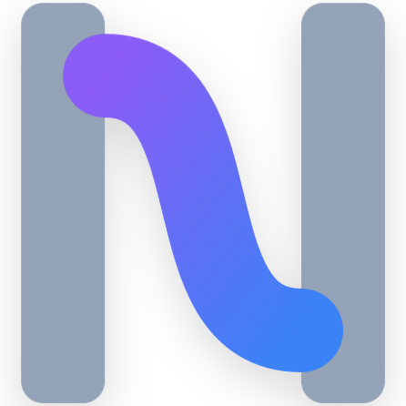

<div align="center">
  
  <h1>Nexa Language</h1>
  <p><b><i>The Dawn of Agent-Native Programming. Write flows, not glue code.</i></b></p>
  <p>
    
    
    
    
  </p>
</div>

---

## ⚡ What is Nexa?

**Nexa** 是一门为大语言模型（LLM）与智能体系统（Agentic Systems）量身定制的**智能体原生 (Agent-Native) 编程语言**。
当代 AI 应用开发充斥着大量的 Prompt 拼接、臃肿的 JSON 解析套件、不可靠的正则皮带，以及复杂的框架。Nexa 将高层级的意图路由、多智能体并发组装、管道流传输以及工具执行沙盒提权为核心语法一等公民，直接通过底层的 `Transpiler` 转换为稳定可靠的 Python Runtime，让你能够用最优雅的语法定义最硬核的 LLM 计算图（DAG）。

---

## 🔥 **v0.9-alpha EPIC RELEASE**: Test Matrix & SDK Interop Era

Nexa v0.9-alpha 引入了底层的测试引擎、MCP 工具链支持以及大重构后的 Python SDK 动态加载机制：

### 1. 原生测试与断言 (`test` & `assert`)
首创针对 Agent 流程的测试套件，通过语义模糊断言保证系统迭代时不发生退化：
```nexa
test "login_agent" {
    result = LoginBot.run("user: admin");
    assert "包含成功确认信息" against result;
}
```

### 2. 生态集成的终极答案：MCP 支持 (`mcp: "..."`)
直接无缝对齐 Model Context Protocol：
```nexa
tool SearchGlobal {
    mcp: "github.com/nexa-ai/search-mcp"
}
```

### 3. 高速启发式评估 (`fast_match`)
在 `semantic_if` 中介入前置正则拦截，零损耗进行流转：
```nexa
semantic_if "是一句日期提示" fast_match r"\d{4}-\d{2}" against req { ... }
```

### 4. 转译器大升级 (`importlib` SDK Interop)
再也没有生硬的字符串拼接！代码通过纯净的 `from src.api.nexa_runtime import NexaRuntime` 动态装载底层环境实例，为大规模部署提供支持。

*(向下兼容 v0.8.x 引入的协议约束、模型路由和并发编排能力)*

---

## 🚀 Quick Start

### 1. 全局安装
```bash
git clone https://github.com/your-org/nexa.git
cd nexa
pip install -e .
```

### 2. 执行与测试工作流
```bash
# 执行流
nexa run examples/09_cognitive_architecture.nx

# 进行语义断言测试 (v0.9+)
nexa test examples/v0.9_test_suite.nx

# 审计生成的纯净 Python 代码栈
nexa build examples/09_cognitive_architecture.nx
```

---

## 📖 Documentation
- [x] [Nexa v0.9 Syntax Reference](docs/01_nexa_syntax_reference.md)
- [x] [Compiler Architecture](docs/02_compiler_architecture.md)
- [x] [Vision & Roadmap](docs/03_roadmap_and_vision.md)

<div align="center">
  <sub>Built with ❤️ by the Nexa Genesis Team for the next era of automation.</sub>
</div>
