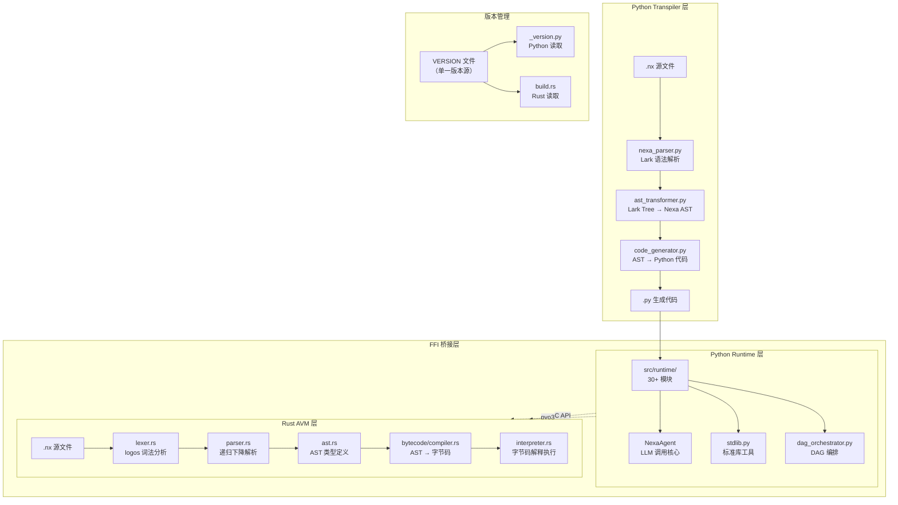
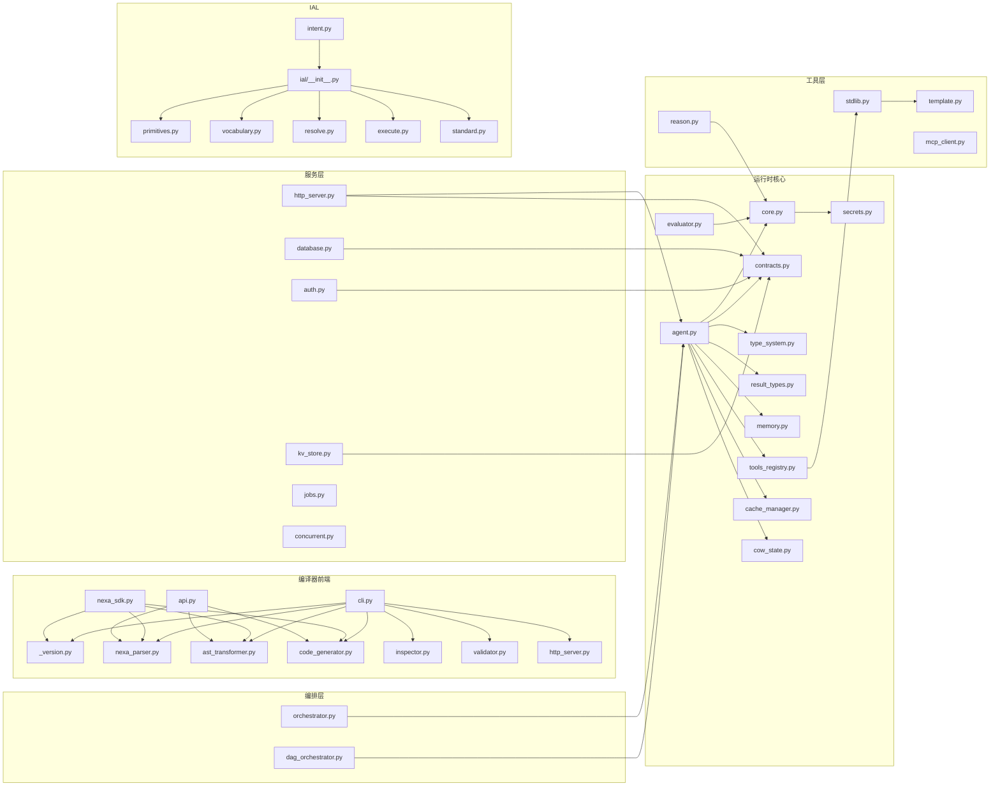
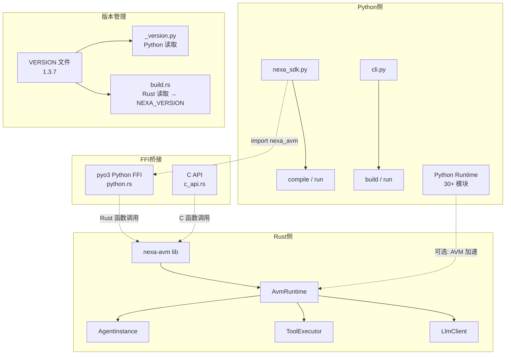

# Nexa 开发者指南 (Developer Guidance)

> 面向第一次接触 Nexa 项目但希望深入开发的人员。
> 版本：v1.3.7 | 最后更新：2026-04-24

---

## 目录

1. [项目总览](#1-项目总览)
2. [架构概览](#2-架构概览)
3. [src/ 目录详解 — 编译器前端](#3-src-目录详解--编译器前端)
4. [src/runtime/ 目录详解 — 运行时后端](#4-srcruntime-目录详解--运行时后端)
5. [src/ial/ 目录详解 — IAL 子系统](#5-srcial-目录详解--ial-子系统)
6. [avm/ 目录详解 — Rust AVM 底座](#6-avm-目录详解--rust-avm-底座)
7. [组件关系图](#7-组件关系图)
8. [开发上手指南](#8-开发上手指南)

---

## 1. 项目总览

### 1.1 Nexa 是什么

**Nexa** 是一门为大语言模型（LLM）与智能体系统（Agentic Systems）量身定制的**智能体原生 (Agent-Native) 编程语言**。它的核心思想是：让开发者用声明式语法定义 Agent 计算图（DAG），而不是手写胶水代码。

Nexa 的 `.nx` 源文件通过 **Transpiler**（转译器）编译为 Python 代码，再由 Python 运行时执行。同时，项目正在开发 Rust 编写的 **AVM (Agent Virtual Machine)** 作为高性能底层执行引擎。

### 1.2 核心设计理念

| 理念 | 说明 |
|------|------|
| **Agent-Native** | Agent 是语言一等公民，`agent` 声明直接映射为 LLM 调用单元 |
| **Transpiler 架构** | `.nx` → Parser → AST → Transformer → CodeGenerator → `.py`，不直接执行 |
| **Handle-as-dict** | 所有复杂类型（Struct/Enum/Trait/Template）在运行时用 dict 表示，保持 JSON 兼容 |
| **渐进式类型系统** | 类型注解可选，从无类型开始逐步添加，三级模式 (strict/warn/forgiving) |
| **契约式编程 (DbC)** | `requires`/`ensures`/`invariant` 约束 Agent 行为，支持语义契约（LLM 判断） |
| **Intent-Driven Development** | `.nxintent` 文件让需求文档变成可执行测试 |

### 1.3 技术栈概览

| 层级 | 语言 | 核心职责 |
|------|------|----------|
| **编译器前端** | Python (Lark) | 语法解析、AST 构建、代码生成 |
| **运行时后端** | Python | Agent 执行、LLM 调用、DAG 编排、所有语言特性运行时 |
| **AVM 底座** | Rust | 高性能字节码解释器、WASM 沙盒、智能调度、COW 内存 |
| **FFI 桥接** | Rust (pyo3) + C API | Python ↔ Rust 互操作 |

---

## 2. 架构概览

### 2.1 整体架构图



### 2.2 编译执行流程

Nexa 的核心执行路径是 **Transpiler**（转译器）模式：

```
.nx 源文件
  ↓ nexa_parser.py (Lark 解析)
Lark Parse Tree
  ↓ ast_transformer.py (Tree → Dict AST)
Nexa AST (Python Dict)
  ↓ code_generator.py (AST → Python 源码)
.py 生成代码
  ↓ importlib 动态加载 / 直接执行
Python Runtime 执行
```

关键点：
- **AST 是 Python Dict**，不是自定义类。每个节点有 `type` 字段标识节点类型。
- **CodeGenerator 生成完整 Python 文件**，包含 BOILERPLATE（运行时导入）和所有函数定义。
- **运行时通过 `importlib` 动态加载**生成的 `.py` 文件执行。

### 2.3 双层架构

| 层 | 语言 | 状态 | 说明 |
|----|------|------|------|
| Python Transpiler + Runtime | Python | ✅ 生产可用 | 当前主要执行路径 |
| Rust AVM | Rust | 🔧 alpha 开发中 | 高性能底座，部分功能已实现 |

两层通过 FFI (pyo3 / C API) 桥接，未来目标是 AVM 成为主要执行引擎。

---

## 3. src/ 目录详解 — 编译器前端

### 3.1 nexa_parser.py — Lark 语法定义与解析器

**职责**：定义 Nexa 的完整语法（Lark EBNF 格式），并将 `.nx` 源代码解析为 Lark Parse Tree。

**核心内容**：
- `nexa_grammar`：600+ 行 Lark EBNF 语法定义，涵盖所有 Nexa 语法结构
- `parse()` 函数：调用 Lark 解析器，返回 Parse Tree 对象
- 语法覆盖：`agent_decl`、`flow_decl`、`protocol_decl`、`tool_decl`、`test_decl`、`type_decl`、`job_decl`、`server_decl`、`db_decl`、`auth_decl`、`kv_decl`、`concurrent_decl`、`defer_stmt`、`match_expr`、`struct_decl`、`enum_decl`、`trait_decl`、`impl_decl` 等

**版本演进注释**：语法文件中保留了各版本新增语法的注释（如 `// v1.0.2: 添加语义类型声明支持`、`// v1.1: 渐进式类型系统`），方便追溯特性来源。

**关键设计**：
- 使用 Lark 的 `?` 前缀实现优先级提升（如 `?script_stmt`）
- `%declare` 处理上下文相关关键字（如 `ELSE`）
- `%ignore` 定义空白和注释的忽略规则

### 3.2 ast_transformer.py — Lark Tree → Nexa AST 转换器

**职责**：将 Lark Parse Tree 转换为 Nexa 内部 AST（Python Dict 结构）。

**核心类**：`NexaTransformer(Transformer)` — 继承 Lark 的 Transformer，每个方法对应一个语法规则。

**关键设计**：
- AST 节点是 **Python Dict**，每个节点必有 `type` 字段（如 `"AgentDeclaration"`、`"FlowDeclaration"`）
- 3400+ 行代码，包含 100+ 个转换方法
- 支持 P2-4 Template System 的 `TemplatePart` / `TemplateFilter` dataclass
- 支持 P3-1 String Interpolation 的 `_INTERP_EXPR_PATTERN` 正则验证

**重要方法分类**：

| 类别 | 方法示例 | 说明 |
|------|----------|------|
| 声明类 | `agent_decl`, `flow_decl`, `protocol_decl` | 转换各种声明为 AST Dict |
| 语句类 | `flow_stmt`, `traditional_if_stmt`, `foreach_stmt` | 转换控制流语句 |
| 表达式类 | `binary_expr`, `pipe_expr`, `null_coalesce_expr` | 转换表达式 |
| P3 特性 | `match_expr`, `struct_decl`, `enum_decl`, `trait_decl` | v1.3.7 新增特性 |
| Template | `template_expr`, `template_for`, `template_if` | v1.3.6 模板系统 |

### 3.3 code_generator.py — Nexa AST → Python 代码生成器

**职责**：将 Nexa AST (Dict) 转换为可执行的 Python 源代码。

**核心类**：`CodeGenerator` — 接收 AST Dict，生成完整 Python 文件。

**关键设计**：
- **BOILERPLATE**：生成的每个 `.py` 文件开头都包含一段固定的导入代码（约 50 行），导入所有运行时模块
- **Handle-as-dict Pattern**：Struct/Enum/Trait 在生成代码中用 dict 表示，而非 Python class
- **线程安全注册表 Pattern**：`register_struct()`、`register_enum()` 等使用 threading.Lock 保护
- **StdTool namespace Pattern**：标准库工具通过 `STD_NAMESPACE_MAP` 映射到命名空间

**生成流程**：
1. `generate()` → 按顺序调用各子生成器
2. `_generate_imports()` → 生成导入语句
3. `_generate_agents()` → 生成 Agent 定义和 `flow_main()` 入口
4. `_generate_flows()` → 生成 flow 函数
5. `_generate_tools()` → 生成 tool 函数
6. `_generate_protocols()` → 生成 protocol schema
7. `_generate_tests()` → 生成 test 函数
8. `_generate_types()` → 生成语义类型定义
9. `_generate_jobs()` → 生成 job 定义
10. `_generate_server()` → 生成 HTTP server 定义
11. `_generate_db()` → 生成 database 定义
12. `_generate_auth()` → 生成 auth 定义
13. `_generate_kv()` → 生成 KV store 定义
14. `_generate_concurrent()` → 生成并发定义
15. `_generate_adt()` → 生成 ADT (Struct/Enum/Trait/Impl) 定义

### 3.4 api.py — NexaRuntime API 入口

**职责**：提供 `NexaRuntime` 类，封装完整的编译→执行流程。

**核心方法**：
- `NexaRuntime.run_script(file_path, inputs)` — 编译并执行 `.nx` 文件，返回执行结果

**流程**：Parse → Transform → CodeGen → 写入临时 `.py` → importlib 加载 → 执行 → 返回输出

### 3.5 cli.py — CLI 命令行入口

**职责**：Nexa 的命令行界面，提供 `build`、`run`、`inspect`、`validate`、`lint`、`cache` 等命令。

**核心函数**：
- `build_file()` — 编译 `.nx` → `.py`
- `run_file()` — 编译并执行 `.nx` 文件
- `show_version()` — 显示版本信息（从 `_version.py` 导入）
- `main()` — argparse CLI 入口

**版本管理**：`NEXA_VERSION` 从 `src._version` 导入，不再硬编码。

### 3.6 nexa_sdk.py — Python SDK 接口

**职责**：提供 Python 互操作 API，让 Python 代码直接使用 Nexa 功能。

**核心 API**：
- `compile(source)` — 编译 Nexa 代码，返回 `CompileResult`
- `run(file_path)` — 运行 `.nx` 文件，返回 `RunResult`
- `build(file_path)` — 编译并保存 `.py` 文件
- `Agent()` — 快捷创建 NexaAgent
- `Tool()` — 快捷创建 Tool 定义

**版本管理**：`__version__` 和 `__author__` 从 `src._version` 导入。

### 3.7 _version.py — 单一版本源读取模块

**职责**：从项目根目录 `VERSION` 文件读取版本号，提供给所有 Python 模块使用。

**核心变量**：
- `__version__` — 带 `v` 前缀的版本号（如 `v1.3.7`），用于显示
- `_raw_version` — 纯数字版本号（如 `1.3.7`），用于 Python packaging
- `NEXA_VERSION` — 兼容 `cli.py` 的命名，等于 `__version__`
- `__author__` — `"Nexa Genesis Team"`

**设计原则**：更新版本只需修改根目录 `VERSION` 文件，无需改动任何代码文件。

---

## 4. src/runtime/ 目录详解 — 运行时后端

运行时是 Nexa 最庞大的子系统，包含 30+ 个模块。按功能分为以下几层：

### 4.1 核心层 — LLM 调用与 Agent 执行

#### core.py — LLM 客户端配置

**职责**：初始化 OpenAI 客户端，提供全局 LLM 调用配置。

**核心内容**：
- `client` — OpenAI 客户端实例，从 `secrets.nxs` 读取 API Key 和 Base URL
- `STRONG_MODEL` / `WEAK_MODEL` — 从 secrets 获取模型配置，默认 `minimax-m2.5` / `deepseek-chat`
- `nexa_fallback()` — Agent 执行失败时的回退函数
- `nexa_img_loader()` — 多模态图片加载函数

#### agent.py — NexaAgent 核心

**职责**：Nexa 的核心执行单元 — 一个 Agent 就是一个 LLM 调用单元。

**核心类**：`NexaAgent` — 629 行，Nexa 运行时最重要的类。

**关键属性**：
- `name`, `prompt`, `model`, `role` — Agent 基本配置
- `tools` — 工具列表，通过 `tools_registry.py` 执行
- `timeout`, `retry` — 超时和重试控制
- `contracts` — 契约规格，通过 `contracts.py` 检查
- `cache` — 缓存控制，通过 `cache_manager.py` 管理

**关键方法**：
- `run(input)` — Agent 执行核心：构建 messages → 调用 LLM → 处理 tool_calls → 返回结果
- `_handle_tool_calls()` — 处理 LLM 返回的 tool_calls，循环执行直到无 tool_calls
- `_check_contracts()` — 执行 requires/ensures 契约检查

**依赖关系**：`agent.py` 是运行时的枢纽，几乎依赖所有其他运行时模块。

#### evaluator.py — 语义评估器

**职责**：使用 LLM 判断自然语言条件的真假（语义 if/语义契约的核心）。

**核心函数**：
- `nexa_semantic_eval(condition, target_text)` — 用 WEAK_MODEL 判断条件是否匹配
- `nexa_intent_routing(intent, agents)` — 用 LLM 将意图路由到最合适的 Agent
- 内部使用 `tenacity` 实现重试（3次，指数退避）

#### orchestrator.py — 简单编排器

**职责**：提供 Agent 的基本编排模式。

**核心函数**：
- `join_agents(agents, input)` — 并发执行多个 Agent（ThreadPoolExecutor）
- `nexa_pipeline(input, agents)` — 顺序管道执行

#### dag_orchestrator.py — DAG 编排器

**职责**：支持复杂 DAG 拓扑的编排（分叉、合流、条件分支、并行执行）。

**核心类**：
- `DAGNode` — DAG 节点（Agent/Fork/Merge/Condition/Parallel/Transform）
- `SmartRouter` — 智能路由器，用 LLM 选择最优路径
- `dag_fanout()`, `dag_merge()`, `dag_branch()`, `dag_parallel_map()` — DAG 操作原语

### 4.2 类型与错误系统

#### type_system.py — 渐进式类型系统

**职责**：运行时类型检查引擎，支持三级模式。

**核心类**：
- `TypeChecker` — 类型检查器，验证 Agent 输入输出类型
- `TypeInferrer` — 类型推断器
- `TypeMode` — 运行时模式枚举 (strict/warn/forgiving)
- `LintMode` — lint 模式枚举 (default/warn/strict)
- `TypeExpr` 系列 — 类型表达式 (PrimitiveTypeExpr, GenericTypeExpr, UnionTypeExpr, OptionTypeExpr, ResultTypeExpr, AliasTypeExpr, FuncTypeExpr, SemanticTypeExpr)

**环境变量**：
- `NEXA_TYPE_MODE` — 控制运行时类型检查严格程度
- `NEXA_LINT_MODE` — 控制 lint 类型检查严格程度

#### result_types.py — 错误传播基础设施

**职责**：实现 `?` 操作符和 `otherwise` 内联错误处理的核心类型。

**核心类**：
- `NexaResult` — 类似 Rust `Result<T, E>`，ok 或 err
- `NexaOption` — 类似 Rust `Option<T>`，some 或 none
- `ErrorPropagation` — `?` 操作符触发的内部异常，用于 early-return
- `propagate_or_else()` — 统一处理 `?` 和 `otherwise` 逻辑
- `try_propagate()` — 在 flow 函数中捕获 ErrorPropagation

#### contracts.py — 契约式编程运行时

**职责**：Design by Contract (DbC) 运行时引擎。

**核心类**：
- `ContractSpec` — 契约规格（包含 requires/ensures/invariant 列表）
- `ContractClause` — 契约条款（确定性或语义）
- `ContractViolation` — 契约违反异常
- `check_requires()` / `check_ensures()` — 契约检查函数
- `capture_old_values()` — 捕获 `old()` 值用于 ensures 检查

**特色**：支持**语义契约** — 自然语言条件通过 `evaluator.py` 的 LLM 判断真假。

### 4.3 语言特性运行时

#### pattern_matching.py — 模式匹配运行时

**职责**：P3-3 模式匹配的运行时支持函数。

**核心函数**：
- `nexa_match_pattern(pattern, value)` — 将值与模式 AST 匹配，返回变量绑定
- `nexa_destructure(pattern, value)` — 解构赋值
- `nexa_make_variant(name, fields)` — 创建 enum variant
- 7 种模式类型：wildcard、literal、variable、constructor、tuple、list、dict

#### adt.py — 代数数据类型运行时

**职责**：P3-4 ADT (Struct/Enum/Trait/Impl) 的运行时支持。

**核心设计**：**Handle-as-dict Pattern** — 所有 ADT 实例在运行时用 dict 表示：
- Struct: `{'_nexa_struct': 'Point', '_nexa_struct_id': 1, 'x': 1, 'y': 2}`
- Enum variant: `{'_nexa_variant': 'Some', '_nexa_enum': 'Option', '_nexa_variant_id': 1, '_nexa_fields': [42]}`

**核心函数**：
- `register_struct()` / `make_struct_instance()` — Struct 注册与实例化
- `register_enum()` / `make_variant()` — Enum 注册与 variant 创建
- `register_trait()` / `register_impl()` / `call_trait_method()` — Trait 系统
- 线程安全注册表：`_struct_registry`、`_enum_registry`、`_trait_registry`、`_impl_registry`

#### concurrent.py — 结构化并发运行时

**职责**：P2-2 Agent-Native 并发运行时。

**核心类**：
- `NexaChannel` — 线程安全无界通道 (queue.Queue)
- `NexaTask` — 后台任务句柄 (concurrent.futures)
- `NexaSchedule` — 周期调度器
- `NexaConcurrencyRuntime` — 全局单例注册表

**Nexa 特色**：
- `spawn` 可接受 NexaAgent 作为 handler → `agent.run(context)`
- `parallel/race` 可并行运行多个 Agent
- 无新增外部依赖（全部 Python stdlib）

### 4.4 基础设施层

#### memory.py — 内存管理器

**职责**：Agent 上下文内存管理（local/shared/persistent 三级作用域）。

**核心类**：`MemoryManager` — 简单的 Dict-based 内存管理。
- `global_memory` — 全局单例

#### secrets.py — 密钥管理

**职责**：从 `secrets.nxs` 文件和环境变量读取敏感配置。

**核心类**：
- `ConfigNode` — 属性访问代理，支持 Dict 和环境变量 fallback
- `nexa_secrets` — 全局单例，提供 `get()`、`get_model_config()` 等方法

#### cache_manager.py — 智能缓存管理器

**职责**：编程语言层面的缓存机制，支持语义缓存和多级缓存。

**核心类**：
- `NexaCacheManager` — 缓存管理器
- `CacheEntry` — 缓存条目（key/value/semantic_hash/metadata）

#### cow_state.py — Copy-on-Write Agent 状态

**职责**：O(1) 状态分支，支持 Tree-of-Thoughts 模式。

**核心类**：`CowAgentState` — COW 实现，clone() 只创建新引用，修改时才创建本地副本。

#### meta.py — 运行时元数据

**职责**：提供循环计数和上次结果等运行时元数据。

**核心类**：`RuntimeMeta` — `loop_count`、`last_result` 属性。
- `runtime` — 全局单例代理

### 4.5 服务层

#### http_server.py — 内置 HTTP 服务器

**职责**：P1-4 声明式 HTTP Server DSL 运行时。

**核心特色**：
- **Agent 即 Handler**：`route GET "/chat" => ChatBot`
- **语义路由**：LLM 意图匹配请求到最适合的 Agent
- **DAG pipeline 路由**：`route POST "/analyze" => Extractor |>> Analyzer |>> Reporter`
- **契约联动**：requires→400, ensures→500

#### database.py — 内置数据库运行时

**职责**：P1-5 数据库集成引擎。

**核心内容**：
- 连接注册表：全局 Dict 管理所有活跃连接
- `NexaSQLite` — Python sqlite3 实现，零额外依赖
- `NexaPostgres` — psycopg2 可选依赖实现
- Agent 记忆接口：`agent_memory_query/agent_memory_store`

#### auth.py — 认证运行时

**职责**：P2-1 三层认证模型。

**核心架构**：
- Layer 1: API Key Auth — Agent-to-Agent / M2M 认证
- Layer 2: JWT Auth — 服务间认证
- Layer 3: OAuth Auth — 人类用户认证（与 HTTP Server 联动）

#### kv_store.py — KV 存储引擎

**职责**：P2-3 Agent-Native 统一键值存储。

**三层设计**：
- Layer 1: Generic KV — 15 通用键值操作
- Layer 2: Agent Memory KV — 语义搜索 + 上下文存储
- Layer 3: KV-Contract 联动 — 与契约系统集成

#### jobs.py — 后台任务系统

**职责**：P1-3 语言原生后台任务系统。

**核心特性**：
- 优先级队列（low/normal/high/critical）
- 重试 + exponential backoff + 超时
- 死信处理 + on_failure hooks
- 定时调度（enqueue_in / enqueue_at）
- Agent Job — 使用 Agent 执行后台 LLM 任务

### 4.6 工具层

#### stdlib.py — 标准库

**职责**：内置工具集，提供 HTTP、文件、数据处理等常用工具。

**核心内容**：3686 行，包含：
- `STD_NAMESPACE_MAP` — 标准库命名空间映射（`std.http`、`std.db`、`std.auth` 等）
- `STD_TOOLS_SCHEMA` — 标准库工具 schema 定义
- `execute_stdlib_tool()` — 标准库工具执行入口
- 30+ 内置工具实现

#### tools_registry.py — 工具注册表

**职责**：工具执行注册表，桥接 stdlib 和自定义工具。

**核心函数**：`execute_tool()` — 根据工具名查找并执行（stdlib 或自定义）。

#### mcp_client.py — MCP 客户端

**职责**：Model Context Protocol 客户端 stub，读取本地 JSON 格式工具定义。

#### template.py — 模板引擎

**职责**：P2-4 Agent-Native 模板渲染引擎。

**核心类**：`NexaTemplateRenderer` — 30+ 滤镜，支持 Agent 模板注入。

**特色**：
- Agent Prompt template：自动注入 agent 上下文
- Multi-source Slot Fill：优先级变量解析（explicit > auth > kv > memory > agent_attrs）

#### reason.py — 推理原语

**职责**：上下文感知推理调用，根据返回类型自动约束模型输出。

**核心函数**：`reason()` / `reason_float()` / `reason_int()` / `reason_bool()` / `reason_str()` / `reason_dict()` / `reason_list()` / `reason_model()`

### 4.7 Agent 工具链

#### inspector.py — 代码结构分析器

**职责**：`nexa inspect` 命令的后端，提取 `.nx` 文件的完整 JSON 结构描述。

**核心函数**：`inspect_nexa_file()` — 提取所有 agents、tools、protocols、flows、tests、types、imports，并推断 DAG 拓扑。

#### validator.py — 语法验证器

**职责**：`nexa validate` 命令的后端，验证 `.nx` 文件并返回结构化错误报告。

**核心类**：`ValidationError` — 每个错误包含 `fix_hint`，支持 Agent 自动修复。

#### debugger.py — 调试器

**职责**：断点、变量查看、单步执行。

**核心类**：`NexaDebugger` — 支持 Agent/Flow 断点。

#### profiler.py — 性能分析器

**职责**：Token 消耗、执行时间追踪。

**核心类**：`NexaProfiler` — 记录每次 LLM 调用的 token 和时间。

### 4.8 记忆系统

#### long_term_memory.py — 长期记忆

**职责**：为 Agent 提供持久化的长期记忆和经验存储。

**核心类**：`LongTermMemory` — 支持 experience/lesson/knowledge/preference 四类记忆。

#### knowledge_graph.py — 知识图谱

**职责**：将 Agent 记忆以结构化方式存储和查询。

**核心类**：`Entity`、`Relation`、`KnowledgeGraph` — 实体-关系图谱。

#### memory_backend.py — 记忆后端

**职责**：记忆存储后端抽象。

**核心类**：
- `MemoryBackend` — 抽象基类
- `SQLiteMemoryBackend` — SQLite 实现
- `InMemoryBackend` — 内存实现
- `VectorMemoryBackend` — 向量搜索实现

### 4.9 人机交互与安全

#### hitl.py — Human-in-the-Loop

**职责**：暂停执行等待人类审批/输入。

**核心类**：`ApprovalStatus` (APPROVED/REJECTED/TIMEOUT/CANCELLED)、`HITLManager`。

#### opencli.py — Open-CLI 深度接入

**职责**：类似 spectreconsole/open-cli 的宿主命令行交互标准。

**核心类**：`OpenCLI` — 通用 CLI 框架；`NexaCLI` — Nexa 专用 CLI（版本从 `_version.py` 导入）。

#### rbac.py — RBAC 权限管理

**职责**：基于角色的访问控制。

**核心类**：`RBACManager`、`Role`、`Permission`、`SecurityContext`。

#### config.py — 项目配置加载器

**职责**：从 `nexa.toml` 加载项目配置。

**配置优先级**：CLI flag > 环境变量 > nexa.toml > 默认值

#### compactor.py — 上下文压缩器

**职责**：压缩 Agent 对话上下文，减少 token 消耗。

---

## 5. src/ial/ 目录详解 — IAL 子系统

IAL (Intent Assertion Language) 是 Nexa 的核心差异化特性 — 让需求文档变成可执行测试。

### 5.1 IAL 架构概览

IAL 的核心工作流程：

```
"they see success response"
    ↓ vocabulary lookup
"component.success_response"
    ↓ component expansion
["status 2xx", "body contains 'ok'"]
    ↓ standard term resolution
[Check(InRange, "response.status", 200-299), Check(Contains, "response.body", "ok")]
    ↓ execution
[✓, ✓]
```

### 5.2 primitives.py — 原语类型定义

**职责**：定义 IAL 引擎的所有原子检查操作和断言原语。

**核心类**：
- `CheckOp` — 检查操作枚举（InRange/Contains/Matches/Equals/TypeOf/HasKey/Length/Regex/Semantic/NotNull/Truthy/GreaterThan/LessThan/StartsWith/EndsWith）
- `Check` — 原子检查（op + target + expected）
- `AgentAssertion` — Agent 断言（调用 Agent 验证）
- `ProtocolCheck` — Protocol 检查
- `PipelineCheck` — Pipeline 检查
- `SemanticCheck` — 语义检查（LLM 判断）
- `Http` / `Cli` / `CodeQuality` / `ReadFile` / `FunctionCall` — 专用原语
- `CheckResult` / `ScenarioResult` / `FeatureResult` — 结果类型

### 5.3 vocabulary.py — 术语存储与模式匹配引擎

**职责**：Glossary 术语映射和模式匹配。

**核心类**：`TermEntry` — 术语条目，四种类型：
- `expansion` — 展开为多个术语（递归重写）
- `primitive` — 直接映射到 IAL 原语
- `call` — 调用 Nexa Agent 做单元测试
- `pattern` — 模式字符串，支持 `{param}` 占位符

**核心类**：`Vocabulary` — 术语存储和查找引擎。

### 5.4 resolve.py — 递归术语重写引擎

**职责**：IAL 的核心引擎 — 将自然语言断言递归解析为可执行测试。

**核心函数**：
- `resolve(assertion_text, vocabulary)` — 递归术语重写
- `resolve_scenario_assertions(scenario, vocabulary)` — 批量解析场景断言
- `MAX_RECURSION_DEPTH` — 防止无限递归（默认 10）

### 5.5 standard.py — 标准词汇定义

**职责**：定义 Nexa IAL 的默认术语映射，覆盖 HTTP、Agent、Protocol、Pipeline、Code 等领域。

**核心函数**：`create_vocabulary()` — 创建包含所有标准术语的 Vocabulary 实例。

### 5.6 execute.py — 原语执行引擎

**职责**：执行 IAL 原语并返回 CheckResult。

**执行策略**：
- `AgentAssertion` → 调用 Agent 获取输出 → 执行 checks
- `ProtocolCheck` → 检查数据是否符合 protocol schema
- `PipelineCheck` → 验证 DAG 管道输出
- `SemanticCheck` → 用 LLM 判断语义条件

---

## 6. avm/ 目录详解 — Rust AVM 底座

### 6.1 AVM 架构概览

AVM (Agent Virtual Machine) 是 Nexa 的高性能 Rust 底座，目标是替代 Python 运行时成为主要执行引擎。

**模块结构**：

```
avm/src/
├── lib.rs          # 库入口，模块声明，VERSION 常量
├── main.rs         # CLI 入口 (clap)
├── compiler/       # 词法分析、语法解析、AST、类型检查
├── bytecode/       # 字节码指令集与编译器
├── vm/             # 解释器、调度器、上下文分页、COW内存、执行栈
├── runtime/        # Agent/Tool/LLM/Contracts/ResultTypes/Jobs
├── wasm/           # WASM 运行时与沙盒
├── ffi/            # Python FFI (pyo3) 与 C API
└── utils/          # 错误类型定义
```

**版本管理**：`build.rs` 从项目根目录 `VERSION` 文件读取版本号，设置 `NEXA_VERSION` 环境变量。Rust 代码通过 `env!("NEXA_VERSION")` 获取版本。

### 6.2 compiler/ — 编译器模块

#### mod.rs — 模块声明

声明 `lexer`、`parser`、`ast`、`type_checker` 子模块，并 re-export 所有公开类型。

#### lexer.rs — 词法分析器

**职责**：使用 `logos` crate 实现高性能词法分析。

**核心类型**：`Token` — 50+ 个 Token 变体，涵盖所有 Nexa 关键字和运算符。

**核心函数**：
- `tokenize(source)` — 将源代码转换为 `Vec<TokenWithSpan>` + 错误列表
- `TokenWithSpan` — Token + 位置信息（行号、列号）

**特色**：使用 logos 的 `#[token("...")]` 和 `#[regex("...")]` 宏定义 Token，性能远优于手写词法分析器。

#### parser.rs — 递归下降解析器

**职责**：将 Token 序列解析为 AST。

**核心类**：`Parser` — 递归下降解析器，维护 `tokens` 和 `pos` 状态。

**核心方法**：
- `parse_from_source(source)` — 从源码解析为 `Program`
- `parse_program()` — 解析顶层声明
- `parse_agent_decl()` / `parse_flow_decl()` 等 — 解析各类型声明

#### ast.rs — AST 类型定义

**职责**：定义所有 AST 节点类型。

**核心类型**：
- `Program` — 顶层程序（declarations + flows + tests）
- `Declaration` — 声明枚举（Tool/Protocol/Agent/TypeAlias/Job）
- `AgentDeclaration` — Agent 声明（含 contracts、input_type、output_type）
- `FlowDeclaration` — Flow 声明（含 contracts、return_type）
- `Statement` — 语句枚举（50+ 种语句类型）
- `TypeExpr` — 类型表达式枚举

**设计**：使用 `#[derive(Debug, Clone)]` 和 `serde::{Deserialize, Serialize}` 支持序列化。

#### type_checker.rs — 类型检查器

**职责**：渐进式类型检查实现。

**核心类**：`TypeChecker` — 维护 `type_registry` 和 `protocol_registry`，支持三级模式。

### 6.3 bytecode/ — 字节码模块

#### mod.rs — 模块声明

声明 `instructions` 和 `compiler` 子模块。

#### instructions.rs — 字节码指令集

**职责**：定义 AVM 虚拟机的所有字节码指令。

**核心类型**：
- `OpCode` — 50+ 个操作码枚举（控制流/栈操作/Agent操作/工具操作/类型操作/并发操作）
- `Operand` — 操作数类型（Register/ConstantIndex/StringIndex/Label/NameRef）
- `Constant` — 常量类型（Int/Float/String/Bool/Null）
- `BytecodeModule` — 字节码模块（指令序列 + 常量池 + 元数据）
- `BytecodeMetadata` — 元数据（compiler_version 使用 `env!("NEXA_VERSION")`）

#### compiler.rs — 字节码编译器

**职责**：将 AST 编译为字节码。

**核心类**：`BytecodeCompiler` — 维护 `locals`、`globals`、`loop_stack`、`constant_counter`。

**编译流程**：遍历 AST → 生成指令 → 填充常量池 → 输出 BytecodeModule。

### 6.4 vm/ — 虚拟机模块

#### mod.rs — 模块声明

声明 `context_pager`、`cow_memory`、`interpreter`、`scheduler`、`stack` 子模块。

#### interpreter.rs — 字节码解释器

**职责**：执行编译后的字节码指令。

**核心类**：`Interpreter` — 维护 `stack`、`call_stack`、`globals`、`agents`。

**契约集成**：在 AST 级别执行契约检查（而非字节码级别），requires 失败跳过执行，ensures 失败触发 retry/fallback。

#### scheduler.rs — 智能调度器

**职责**：基于优先级的调度、负载均衡和动态资源分配。

**核心类型**：
- `NodeState` — DAG 节点状态（Pending/Ready/Running/Completed/Failed）
- `DAGSchedule` — DAG 调度计划
- `SmartScheduler` — 智能调度器，支持 DAG 拓扑排序 + 自动依赖解析

#### context_pager.rs — 向量虚存分页

**职责**：AVM 接管内存，自动执行对话历史的向量化置换与透明加载。

**核心类型**：
- `Message` / `MessageRole` — 对话消息
- `Page` / `PageStats` — 内存页
- `ContextPager` — 分页管理器，支持 LRU/LFU/Hybrid 淘汰策略

#### cow_memory.rs — Copy-on-Write 内存

**职责**：O(1) 状态分支，支持 Tree-of-Thoughts 模式。

**核心类型**：
- `MemoryValue` — 内存值类型（String/Integer/Float/Boolean/List/Dict/Null）
- `CowMemory` — COW 内存实现，使用 `Arc<RwLock>` 实现线程安全

#### stack.rs — 执行栈

**职责**：AVM 运行时值和执行栈。

**核心类型**：
- `Value` — 运行时值枚举（Null/Bool/Int/Float/String/List/Dict/AgentRef/ToolRef/Future）
- `Stack` — 执行栈
- `CallFrame` — 调用帧

### 6.5 runtime/ — AVM 运行时模块

#### mod.rs — 模块声明与 AvmRuntime

声明 `agent`、`tool`、`llm`、`contracts`、`result_types`、`jobs` 子模块。

**核心类**：`AvmRuntime` — AVM 运行时环境，包含 Agent 注册表、工具注册表、LLM 客户端、调度器。

#### agent.rs — Agent 运行时

**核心类型**：
- `AgentConfig` — Agent 配置（name/prompt/role/model/tools/cache_enabled）
- `AgentInstance` — Agent 实例
- `AgentRegistry` — Agent 注册表

#### tool.rs — Tool 运行时

**核心类型**：
- `ToolSpec` — 工具定义（name/description/parameters）
- `ToolExecutor` trait — 工具执行器接口

#### llm.rs — LLM 运行时

**核心类型**：
- `LlmConfig` — LLM 配置（provider/api_key/base_url/default_model/cache_enabled）
- `LlmClient` — LLM 客户端

#### contracts.rs — 契约运行时

Rust 版本的契约检查引擎，与 Python 版本功能对齐。

#### result_types.rs — 错误传播

Rust 版本的 NexaResult/NexaOption/ErrorPropagation，与 Python 版本功能对齐。

#### jobs.rs — 后台任务系统

Rust 版本的 Job 系统，支持优先级队列和 exponential backoff。

### 6.6 wasm/ — WASM 沙盒模块

#### mod.rs — 模块声明

声明 `runtime` 和 `sandbox` 子模块。

#### runtime.rs — WASM 运行时

基于 `wasmtime` 的 WASM 运行时实现（需要 `wasm` feature 启用）。

#### sandbox.rs — WASM 沙盒

四级权限模型的 WASM 安全沙盒。

### 6.7 ffi/ — FFI 模块

#### mod.rs — 模块声明

声明 `python` 和 `c_api` 子模块。

#### python.rs — Python FFI (pyo3)

**职责**：通过 pyo3 提供 Python ↔ Rust 互操作。

**核心类**：
- `PyModuleInfo` — 模块信息（name/version/description）
- `PyAvm` — AVM Python 包装类
- `PyValue` — Value Python 包装类

**核心函数**：
- `compile()` — 从 Python 编译 Nexa 代码
- `run()` — 从 Python 运行 Nexa 代码
- `avm_module()` — pyo3 模块定义，导出 `__version__`（使用 `env!("NEXA_VERSION")`）

#### c_api.rs — C API

**职责**：提供 C 语言互操作接口。

**核心函数**：
- `avm_version()` — 返回版本字符串（使用 `env!("NEXA_VERSION")`）
- `avm_build_info()` — 返回构建信息
- `avm_compile()` / `avm_run()` — C 语言编译/运行接口
- `avm_free_string()` — 释放 C 字符串

### 6.8 utils/ — 工具模块

#### mod.rs — 模块声明

声明 `error` 子模块。

#### error.rs — 错误类型定义

**核心类型**：`AvmError` — 使用 `thiserror` 定义的错误枚举，涵盖 LexicalError/ParseError/TypeError/RuntimeError/StackError/WasmError/IoError 等。

**核心类型**：`AvmResult` — `Result<T, AvmError>` 类型别名。

### 6.9 lib.rs / main.rs — 入口文件

#### lib.rs — 库入口

- 声明所有子模块（compiler/bytecode/vm/runtime/utils/wasm/ffi）
- Re-export `AvmError` 和 `AvmResult`
- 定义 `VERSION` 常量（使用 `env!("NEXA_VERSION")`，由 build.rs 设置）

#### main.rs — CLI 入口

- 使用 `clap` 定义 CLI 命令：`build`、`run`、`exec`、`disasm`
- 当前为 stub 实现（TODO: 完善功能）

---

## 7. 组件关系图

### 7.1 Python 内部组件依赖关系



### 7.2 Rust AVM 内部模块依赖关系

```mermaid
flowchart TB
    lib[lib.rs<br/>VERSION 常量] --> compiler[compiler/]
    lib --> bytecode[bytecode/]
    lib --> vm[vm/]
    lib --> runtime[runtime/]
    lib --> wasm[wasm/]
    lib --> ffi[ffi/]
    lib --> utils[utils/]

    compiler --> lexer[lexer.rs<br/>logos 词法分析]
    compiler --> parser[parser.rs<br/>递归下降解析]
    compiler --> ast[ast.rs<br/>AST 类型定义]
    compiler --> type_checker[type_checker.rs<br/>渐进式类型检查]

    bytecode --> instructions[instructions.rs<br/>OpCode + BytecodeModule]
    bytecode --> bcompiler[compiler.rs<br/>AST → 字节码]

    vm --> interpreter[interpreter.rs<br/>字节码解释执行]
    vm --> scheduler[scheduler.rs<br/>DAG 拓扑调度]
    vm --> context_pager[context_pager.rs<br/>向量虚存分页]
    vm --> cow_memory[cow_memory.rs<br/>COW 内存管理]
    vm --> stack[stack.rs<br/>Value + Stack + CallFrame]

    runtime --> agent_rs[agent.rs<br/>AgentConfig + AgentRegistry]
    runtime --> tool_rs[tool.rs<br/>ToolSpec + ToolExecutor]
    runtime --> llm_rs[llm.rs<br/>LlmClient + LlmConfig]
    runtime --> contracts_rs[contracts.rs<br/>ContractViolation]
    runtime --> result_types_rs[result_types.rs<br/>NexaResult + NexaOption]
    runtime --> jobs_rs[jobs.rs<br/>JobQueue + JobPriority]

    ffi --> python_rs[python.rs<br/>pyo3 Python FFI]
    ffi --> c_api[c_api.rs<br/>C 语言 FFI]

    wasm --> wasm_runtime[runtime.rs<br/>wasmtime 运行时]
    wasm --> sandbox[sandbox.rs<br/>四级权限沙盒]

    utils --> error[error.rs<br/>AvmError + AvmResult]

    bcompiler --> ast
    bcompiler --> instructions
    interpreter --> instructions
    interpreter --> stack
    interpreter --> contracts_rs
    interpreter --> result_types_rs
    python_rs --> agent_rs
    python_rs --> tool_rs
    c_api --> error
```



### 7.3 Python ↔ Rust 交互关系



**当前交互状态**：
- Python ↔ Rust FFI 已实现基础框架（pyo3 模块定义、C API 函数签名）
- 但 AVM 的核心功能（编译、执行）尚未完全实现，Python 运行时仍是主要执行路径
- 未来目标是 AVM 成为主要执行引擎，Python 运行时作为 fallback

---

## 8. 开发上手指南

### 8.1 环境搭建

#### Python 环境

```bash
# 1. 克隆仓库
git clone https://github.com/ouyangyipeng/Nexa.git
cd Nexa

# 2. 创建虚拟环境
python3 -m venv venv
source venv/bin/activate  # Linux/Mac

# 3. 安装依赖
pip install -e .

# 4. 配置 API Key（创建 secrets.nxs）
# 格式参考项目根目录的 secrets.nxs 示例
```

#### Rust 环境（AVM 开发）

```bash
# 1. 安装 Rust
curl --proto '=https' --tlsv1.2 -sSf https://sh.rustup.rs | sh

# 2. 编译 AVM
cd avm
cargo build

# 3. 运行测试
cargo test

# 4. 启用 WASM feature（可选）
cargo build --features wasm

# 5. 启用 Python FFI（可选）
cargo build --features python-ffi
```

### 8.2 项目构建与运行

#### 编译并运行 Nexa 脚本

```bash
# 编译 .nx → .py
nexa build examples/01_hello_world.nx

# 编译并运行
nexa run examples/01_hello_world.nx

# 检查代码结构
nexa inspect examples/01_hello_world.nx

# 验证语法
nexa validate examples/01_hello_world.nx
```

#### Python SDK 使用

```python
import nexa

# 运行脚本
result = nexa.run("script.nx")

# 创建 Agent
bot = nexa.Agent(name="MyBot", prompt="You are a helpful assistant", model="gpt-4")
response = bot.run("Hello!")

# 编译代码
module = nexa.compile("agent TestBot { prompt: 'test' }")
```

### 8.3 开发流程：新增语法特性的完整流程

以新增一个语言特性（如 `defer` 语句）为例，完整流程如下：

#### Step 1: 修改语法定义 (`nexa_parser.py`)

在 `nexa_grammar` 中添加新语法规则：

```python
# 在 script_stmt 中添加 defer_stmt
?script_stmt: ... | defer_stmt

# 定义 defer_stmt 规则
defer_stmt: "defer" flow_stmt
```

#### Step 2: 修改 AST 转换器 (`ast_transformer.py`)

添加对应的转换方法：

```python
def defer_stmt(self, args):
    """defer 语句 — 延迟执行"""
    return {
        "type": "DeferStatement",
        "body": args[0],
    }
```

#### Step 3: 修改代码生成器 (`code_generator.py`)

在 `_generate_statement()` 中添加生成逻辑：

```python
elif st_type == "DeferStatement":
    # 生成 defer 注册代码
    lines.append(f"_nexa_defer_register(lambda: {self._generate_statement(node['body'])})")
```

#### Step 4: 添加运行时支持 (`src/runtime/`)

在适当模块中添加运行时函数：

```python
_defer_stack = []

def _nexa_defer_register(fn):
    """Register a defer function"""
    _defer_stack.append(fn)

def _nexa_defer_execute():
    """Execute all defer functions in LIFO order"""
    while _defer_stack:
        fn = _defer_stack.pop()
        fn()
```

#### Step 5: 更新 BOILERPLATE (`code_generator.py`)

在 BOILERPLATE 导入中添加新运行时函数。

#### Step 6: 编写测试 (`tests/`)

创建对应的测试文件，覆盖各种使用场景。

#### Step 7: 更新文档

- 更新 `docs/01_nexa_syntax_reference.md` 添加语法说明
- 更新 `docs/02_compiler_architecture.md` 添加 AST/CodeGen 变更说明
- 创建 `docs/release_notes/vX.Y.Z.md` 发布说明

#### Step 8: 更新版本号

只需修改根目录 `VERSION` 文件：

```bash
echo "1.3.8" > VERSION
```

所有 Python 和 Rust 代码会自动读取新版本号。

### 8.4 调试技巧

#### CLI Debug

```bash
# 查看生成的 Python 代码
nexa build script.nx  # 生成 script.py，可直接查看

# 检查代码结构
nexa inspect script.nx  # JSON 格式输出所有声明

# 验证语法错误
nexa validate script.nx  # 结构化错误报告 + fix_hint
```

#### Python Runtime Debug

```python
# 使用 NexaDebugger
from src.runtime.debugger import NexaDebugger
debugger = NexaDebugger()
debugger.set_breakpoint("agent", "ChatBot")
result = debugger.run_script("script.nx")

# 使用 NexaProfiler
from src.runtime.profiler import NexaProfiler
profiler = NexaProfiler()
profiler.start()
# ... 运行 Agent ...
stats = profiler.get_stats()
```

#### AVM Debug

```bash
# 运行 AVM CLI
cd avm
cargo run -- exec examples/01_hello_world.nx

# 查看字节码
cargo run -- disasm output.nxc
```

### 8.5 测试指南

#### Python 测试

```bash
# 运行所有测试
pytest tests/ -v

# 运行特定测试文件
pytest tests/test_contracts.py -v

# 运行特定测试方法
pytest tests/test_contracts.py::TestContracts::test_requires -v
```

#### Rust 测试

```bash
cd avm

# 运行所有测试
cargo test

# 运行特定模块测试
cargo test --lib compiler

# 运行基准测试
cargo bench
```

### 8.6 版本管理

Nexa 使用 **单一版本源 (Single Source of Truth)** 机制：

- **`VERSION` 文件**（项目根目录）：包含纯数字版本号（如 `1.3.7`）
- **Python 侧**：`src/_version.py` 从 VERSION 文件读取，提供 `__version__`（带 `v` 前缀）和 `NEXA_VERSION`
- **Rust 侧**：`avm/build.rs` 在编译时从 VERSION 文件读取，设置 `NEXA_VERSION` 环境变量

**更新版本只需一步**：

```bash
echo "1.4.0" > VERSION
```

所有位置自动生效：
- `src/cli.py` 的 `NEXA_VERSION`
- `src/nexa_sdk.py` 的 `__version__`
- `setup.py` 的 `version`
- `avm/src/lib.rs` 的 `VERSION` 常量
- `avm/src/ffi/python.rs` 的 `__version__`
- `avm/src/ffi/c_api.rs` 的 `avm_version()`
- `avm/src/bytecode/instructions.rs` 的 `compiler_version`

**注意**：`avm/Cargo.toml` 的 `version` 字段需要手动同步（Cargo 包管理要求），但会在文件中添加注释提醒。

**README badge**：`README.md` 和 `README_EN.md` 中的版本 badge 是静态图片 URL，发布新版本时需手动更新。

### 8.7 常见问题与陷阱

#### Q1: 修改了语法但 `nexa run` 报错

**原因**：Lark 解析器使用 Earley 算法，语法修改可能引入歧义。

**解决**：
1. 先用 `nexa validate` 检查语法错误
2. 检查 `nexa_parser.py` 中的 `%declare` 和优先级声明
3. 使用 Lark 的 `?` 前缀提升优先级

#### Q2: CodeGenerator 生成的代码导入失败

**原因**：BOILERPLATE 中的导入路径可能不完整。

**解决**：
1. 检查 `code_generator.py` 的 BOILERPLATE 字符串
2. 确保新运行时模块已在 `src/runtime/__init__.py` 中导出
3. 确保新运行时模块已在 BOILERPLATE 中添加导入

#### Q3: AVM 编译失败

**原因**：AVM 代码库有预存的编译错误（部分功能尚未完全实现）。

**解决**：这些是已知问题，不影响 Python 运行时。如需修复 AVM，请参考 `avm/src/` 中的 TODO 注释。

#### Q4: 版本号不一致

**原因**：过去版本号散落在多个文件中。

**解决**：现在已统一为 `VERSION` 文件机制。只需修改 `VERSION` 文件，所有位置自动生效。

#### Q5: secrets.nxs 配置缺失

**原因**：API Key 未配置。

**解决**：
1. 创建 `secrets.nxs` 文件（参考项目示例）
2. 或设置环境变量 `API_KEY` / `OPENAI_API_KEY`

---

## 附录：文件清单速查

### src/ 顶层文件

| 文件 | 行数 | 职责 |
|------|------|------|
| `_version.py` | ~50 | 版本信息读取（单一版本源） |
| `__init__.py` | ~113 | SDK 公共 API 导出 |
| `api.py` | ~61 | NexaRuntime 类 |
| `cli.py` | ~690 | CLI 命令行入口 |
| `nexa_parser.py` | ~604 | Lark 语法定义与解析 |
| `ast_transformer.py` | ~3469 | Lark Tree → Nexa AST 转换 |
| `code_generator.py` | ~2640 | Nexa AST → Python 代码生成 |
| `nexa_sdk.py` | ~523 | Python SDK 接口 |

### src/runtime/ 文件

| 文件 | 行数 | 职责 | 版本 |
|------|------|------|------|
| `__init__.py` | ~286 | 运行时公共 API 导出 | — |
| `agent.py` | ~629 | NexaAgent 核心 | v0.9+ |
| `core.py` | ~54 | LLM 客户端配置 | v0.9+ |
| `evaluator.py` | ~74 | 语义评估器 | v0.9+ |
| `orchestrator.py` | ~32 | 简单编排器 | v0.9+ |
| `dag_orchestrator.py` | ~330 | DAG 编排器 | v0.9+ |
| `memory.py` | ~25 | 内存管理器 | v0.9+ |
| `secrets.py` | ~294 | 密钥管理 | v0.9+ |
| `stdlib.py` | ~3686 | 标准库 | v0.9+ |
| `tools_registry.py` | ~115 | 工具注册表 | v0.9+ |
| `cache_manager.py` | ~435 | 智能缓存 | v0.9+ |
| `cow_state.py` | ~370 | COW Agent 状态 | v1.0.4 |
| `meta.py` | ~131 | 运行时元数据 | v0.9+ |
| `mcp_client.py` | ~67 | MCP 客户端 stub | v0.9+ |
| `reason.py` | ~260 | 推理原语 | v0.9+ |
| `hitl.py` | ~549 | Human-in-the-Loop | v0.9+ |
| `inspector.py` | ~974 | 代码结构分析 | v1.3.0 |
| `validator.py` | ~678 | 语法验证 | v1.3.0 |
| `debugger.py` | ~484 | 调试器 | v1.3.0 |
| `profiler.py` | ~499 | 性能分析 | v1.3.0 |
| `opencli.py` | ~716 | Open-CLI 接入 | v0.9+ |
| `config.py` | ~283 | 项目配置加载 | v0.9+ |
| `compactor.py` | — | 上下文压缩 | v0.9+ |
| `contracts.py` | ~401 | 契约式编程 | v1.2.0 |
| `type_system.py` | ~1294 | 渐进式类型系统 | v1.3.1 |
| `result_types.py` | ~519 | 错误传播 | v1.3.2 |
| `jobs.py` | ~1137 | 后台任务系统 | v1.3.3 |
| `http_server.py` | ~1481 | HTTP 服务器 | v1.3.4 |
| `database.py` | ~1136 | 数据库集成 | v1.3.5 |
| `auth.py` | ~1515 | 认证系统 | v1.3.6 |
| `concurrent.py` | ~712 | 结构化并发 | v1.3.6 |
| `kv_store.py` | ~784 | KV 存储 | v1.3.6 |
| `template.py` | ~1594 | 模板引擎 | v1.3.6 |
| `pattern_matching.py` | ~220 | 模式匹配 | v1.3.7 |
| `adt.py` | ~354 | 代数数据类型 | v1.3.7 |
| `intent.py` | ~1079 | IDD 运行时 | v1.1.0 |
| `long_term_memory.py` | ~483 | 长期记忆 | v0.9+ |
| `knowledge_graph.py` | ~638 | 知识图谱 | v0.9+ |
| `memory_backend.py` | ~426 | 记忆后端 | v0.9+ |
| `rbac.py` | — | RBAC 权限 | v0.9+ |

### src/ial/ 文件

| 文件 | 行数 | 职责 | 版本 |
|------|------|------|------|
| `__init__.py` | ~53 | IAL 公共 API | v1.1.0 |
| `primitives.py` | ~333 | 原语类型定义 | v1.1.0 |
| `vocabulary.py` | ~196 | 术语存储引擎 | v1.1.0 |
| `resolve.py` | ~368 | 递归术语重写 | v1.1.0 |
| `standard.py` | ~272 | 标准词汇定义 | v1.1.0 |
| `execute.py` | ~857 | 原语执行引擎 | v1.1.0 |

### avm/src/ 文件

| 文件 | 行数 | 职责 |
|------|------|------|
| `lib.rs` | ~37 | 库入口 |
| `main.rs` | ~86 | CLI 入口 |
| `compiler/mod.rs` | ~10 | 模块声明 |
| `compiler/lexer.rs` | ~427 | 词法分析器 |
| `compiler/parser.rs` | ~1445 | 递归下降解析器 |
| `compiler/ast.rs` | ~506 | AST 类型定义 |
| `compiler/type_checker.rs` | ~512 | 类型检查器 |
| `bytecode/mod.rs` | ~9 | 模块声明 |
| `bytecode/instructions.rs` | ~430 | 字节码指令集 |
| `bytecode/compiler.rs` | ~872 | 字节码编译器 |
| `vm/mod.rs` | ~15 | 模块声明 |
| `vm/interpreter.rs` | ~488 | 字节码解释器 |
| `vm/scheduler.rs` | ~1519 | 智能调度器 |
| `vm/context_pager.rs` | ~911 | 向量虚存分页 |
| `vm/cow_memory.rs` | ~545 | COW 内存 |
| `vm/stack.rs` | ~200 | 执行栈 |
| `runtime/mod.rs` | ~196 | 运行时模块 + AvmRuntime |
| `runtime/agent.rs` | ~120 | Agent 运行时 |
| `runtime/tool.rs` | ~74 | Tool 运行时 |
| `runtime/llm.rs` | ~82 | LLM 运行时 |
| `runtime/contracts.rs` | ~286 | 契约运行时 |
| `runtime/result_types.rs` | ~392 | 错误传播 |
| `runtime/jobs.rs` | ~775 | 后台任务系统 |
| `wasm/mod.rs` | ~9 | 模块声明 |
| `wasm/runtime.rs` | — | WASM 运行时 |
| `wasm/sandbox.rs` | — | WASM 沙盒 |
| `ffi/mod.rs` | ~10 | 模块声明 |
| `ffi/python.rs` | ~775 | Python FFI |
| `ffi/c_api.rs` | ~811 | C API |
| `utils/mod.rs` | ~7 | 模块声明 |
| `utils/error.rs` | ~80 | 错误类型 |