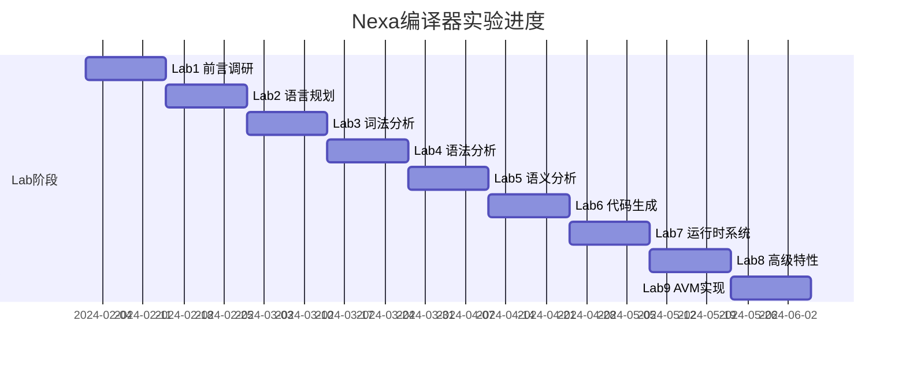

# Nexa Agent编程语言 - 编译原理实验课程设计

> 本文档将Nexa语言开发工作划分为9个实验阶段，对应编译原理课程的9次实验（每两周一次）。

## 实验概述

Nexa是一门面向大语言模型（LLM）与智能体系统（Agentic Systems）的**Agent-Native编程语言**。本实验系列将引导学生从零开始构建一门完整的领域特定语言（DSL），涵盖词法分析、语法分析、语义分析、代码生成、运行时系统等编译器核心模块，最终实现一个可执行的Agent虚拟机（AVM）。

### 实验目标

- 理解编译器的基本结构和工作流程
- 掌握词法分析器和语法分析器的实现方法
- 学习AST（抽象语法树）的设计与遍历
- 实现代码生成器和运行时系统
- 了解高级特性：类型系统、沙盒执行、智能调度

---

## Lab 1: 前言调研与背景研究

### 实验周期
第1-2周

### 实验目标
- 调研现有Agent编程语言和框架
- 理解LLM应用开发的痛点
- 确定Nexa语言的设计目标和应用场景

### 实验内容

#### 1.1 调研报告撰写（在 `~/proj/nexa-docs` 目录）

调研以下内容并撰写报告：

| 调研方向 | 具体内容 |
|---------|---------|
| LLM应用开发现状 | Prompt Engineering、Chain-of-Thought、ReAct等范式 |
| 现有框架分析 | LangChain、AutoGPT、CrewAI、Microsoft Semantic Kernel |
| Agent编排模式 | 多Agent协作、DAG工作流、Pipeline模式 |
| 编程语言设计 | DSL设计原则、语法美学、开发者体验 |

#### 1.2 需求分析文档

分析并记录以下需求：

```markdown
## 痛点分析
1. Prompt拼接混乱 - 大量字符串模板难以维护
2. 工具调用复杂 - 需要手动处理JSON Schema和函数映射
3. 多Agent协作困难 - 缺乏原生的编排语法
4. 调试困难 - 无法追踪Agent执行流程

## 设计目标
- 简洁优雅的语法设计
- 原生支持Agent声明和编排
- 类型安全的工具调用
- 可视化的执行流程
```

### 交付物
- [ ] 调研报告文档（`nexa-docs/01_research_report.md`）
- [ ] 需求分析文档（`nexa-docs/02_requirements_analysis.md`）
- [ ] 竞品对比表格

---

## Lab 2: 语言功能规划与语法设计

### 实验周期
第3-4周

### 实验目标
- 确定Nexa语言的核心特性
- 设计语言的EBNF语法规范
- 编写示例代码验证语法设计的合理性

### 实验内容

#### 2.1 核心特性定义

Nexa语言的核心一等公民：

```
┌─────────────────────────────────────────────────────────────┐
│                    Nexa Language Features                    │
├─────────────────────────────────────────────────────────────┤
│  agent    - 智能体声明，定义LLM实例及其行为                   │
│  tool     - 工具声明，绑定外部执行能力                        │
│  protocol - 协议声明，定义结构化输出约束                      │
│  flow     - 流程声明，编排Agent执行顺序                      │
│  test     - 测试声明，支持语义断言                           │
└─────────────────────────────────────────────────────────────┘
```

#### 2.2 EBNF语法设计

设计并完善以下EBNF规则：

```ebnf
program ::= declaration*

declaration ::= tool_decl | protocol_decl | agent_decl | flow_decl | test_decl

tool_decl ::= "tool" IDENTIFIER "{" tool_body "}"
tool_body ::= ("description:" STRING "," "parameters:" json_object) 
            | ("mcp:" STRING)
            | ("python:" STRING)

protocol_decl ::= "protocol" IDENTIFIER "{" (IDENTIFIER ":" type_spec ",")+ "}"

agent_decl ::= [decorator]* "agent" IDENTIFIER 
               ["implements" IDENTIFIER] 
               ["uses" identifier_list] 
               "{" agent_body "}"

agent_body ::= (IDENTIFIER ":" value ",")*

flow_decl ::= "flow" IDENTIFIER "(" [param_list] ")" "{" statement* "}"

statement ::= assignment | expr_stmt | semantic_if | loop_stmt | match_stmt | try_catch

expression ::= pipeline_expr | dag_expr | primary

pipeline_expr ::= expression ">>" expression

dag_expr ::= fork_expr | merge_expr | branch_expr
fork_expr ::= expression "|>>" "[" identifier_list "]"
merge_expr ::= "[" identifier_list "]" "&>>" expression
branch_expr ::= expression "??" expression ":" expression
```

#### 2.3 示例代码编写

为每个核心特性编写示例代码（保存到 `examples/` 目录）：

```nexa
// examples/01_hello_world.nx
agent Greeter {
    role: "Friendly Assistant",
    model: "gpt-4o-mini",
    prompt: "Greet the user warmly."
}

flow main() {
    result = Greeter.run("Hello, Nexa!");
    print(result);
}
```

### 交付物
- [ ] EBNF语法规范文档
- [ ] 至少5个示例代码文件
- [ ] 语法设计说明文档

---

## Lab 3: 词法分析器实现

### 实验周期
第5-6周

### 实验目标
- 理解词法分析的基本原理
- 实现Nexa语言的Lexer
- 掌握Token的定义和识别

### 实验内容

#### 3.1 Token类型定义

定义Nexa语言的所有Token类型：

```rust
// avm/src/compiler/lexer.rs
#[derive(Debug, Clone, PartialEq, Logos)]
pub enum Token {
    // 关键字
    #[token("agent")] Agent,
    #[token("tool")] Tool,
    #[token("flow")] Flow,
    #[token("protocol")] Protocol,
    #[token("test")] Test,
    
    // 控制流
    #[token("match")] Match,
    #[token("intent")] Intent,
    #[token("semantic_if")] SemanticIf,
    #[token("loop")] Loop,
    #[token("until")] Until,
    
    // 操作符
    #[token(">>")] Pipeline,      // 管道
    #[token("|>>")] Fork,         // DAG分叉
    #[token("&>>")] Merge,        // DAG合流
    #[token("??")] Branch,        // 条件分支
    
    // 字面量
    #[regex(r#""[^"]*""#)] String(String),
    #[regex(r"[0-9]+")] Integer(i64),
    #[regex(r"[a-zA-Z_][a-zA-Z0-9_]*")] Identifier(String),
}
```

#### 3.2 Lexer实现

使用Logos库实现高性能词法分析器：

```rust
pub fn tokenize(source: &str) -> LexResult {
    let mut lexer = Token::lexer(source);
    let mut tokens = Vec::new();
    let mut errors = Vec::new();
    
    while let Some(result) = lexer.next() {
        match result {
            Ok(token) => tokens.push(TokenWithSpan {
                token,
                span: lexer.span(),
            }),
            Err(_) => errors.push((lexer.slice().to_string(), lexer.span())),
        }
    }
    
    LexResult { tokens, errors }
}
```

#### 3.3 测试用例编写

```rust
#[test]
fn test_tokenize_keywords() {
    let source = "agent tool flow";
    let result = tokenize(source);
    assert_eq!(result.tokens.len(), 3);
    assert_eq!(result.tokens[0].token, Token::Agent);
}

#[test]
fn test_tokenize_operators() {
    let source = "input >> Agent1 |>> [Agent2, Agent3]";
    let result = tokenize(source);
    assert!(result.errors.is_empty());
}
```

### 实现文件
- `avm/src/compiler/lexer.rs` - Rust词法分析器（完整实现）
- `src/nexa_parser.py` - Python词法分析器（基于Lark）

### 交付物
- [ ] 完整的Token定义
- [ ] 可运行的Lexer实现
- [ ] Lexer单元测试（覆盖率>80%）
- [ ] 测试报告文档

---

## Lab 4: 语法分析器实现

### 实验周期
第7-8周

### 实验目标
- 理解语法分析的原理和方法
- 实现递归下降解析器
- 构建抽象语法树（AST）

### 实验内容

#### 4.1 AST节点设计

设计AST的核心数据结构：

```rust
// avm/src/compiler/ast.rs
pub struct Program {
    pub declarations: Vec<Declaration>,
    pub flows: Vec<FlowDeclaration>,
    pub tests: Vec<TestDeclaration>,
}

pub enum Declaration {
    Tool(ToolDeclaration),
    Protocol(ProtocolDeclaration),
    Agent(AgentDeclaration),
}

pub struct AgentDeclaration {
    pub name: String,
    pub prompt: Option<String>,
    pub role: Option<String>,
    pub model: Option<String>,
    pub tools: Vec<Expression>,
    pub protocol: Option<String>,
}

pub enum Statement {
    Assignment { target: Expression, value: Expression },
    Expression(Expression),
    SemanticIf { branches: Vec<(Expression, Vec<Statement>)> },
    Loop { condition: Expression, body: Vec<Statement> },
    Match { input: Expression, cases: Vec<MatchCase> },
}

pub enum Expression {
    Identifier(String),
    String(String),
    Pipeline { left: Box<Expression>, right: Box<Expression> },
    DagFork(DagForkExpression),
    AgentCall { name: String, args: Vec<Expression> },
}
```

#### 4.2 递归下降解析器实现

```rust
// avm/src/compiler/parser.rs
impl Parser {
    pub fn parse(&mut self) -> AvmResult<Program> {
        let mut program = Program::default();
        
        while !self.is_at_end() {
            match self.peek_token() {
                Token::Tool => program.declarations.push(
                    Declaration::Tool(self.parse_tool()?)
                ),
                Token::Agent => program.declarations.push(
                    Declaration::Agent(self.parse_agent()?)
                ),
                Token::Flow => program.flows.push(self.parse_flow()?),
                // ... 其他声明类型
            }
        }
        
        Ok(program)
    }
    
    fn parse_agent(&mut self) -> AvmResult<AgentDeclaration> {
        self.expect(Token::Agent)?;
        let name = self.expect_identifier()?;
        // 解析agent属性...
    }
}
```

#### 4.3 错误处理与恢复

实现友好的错误提示：

```rust
pub struct ParseError {
    pub message: String,
    pub span: Span,
    pub suggestions: Vec<String>,
}

impl ParseError {
    pub fn format(&self, source: &str) -> String {
        format!(
            "Parse Error at line {}: {}\n  --> {}\n  {}",
            self.span.start.line,
            self.message,
            source.lines().nth(self.span.start.line - 1).unwrap_or(""),
            " ".repeat(self.span.start.column) + "^"
        )
    }
}
```

### 实现文件
- `avm/src/compiler/parser.rs` - Rust解析器
- `avm/src/compiler/ast.rs` - AST定义

### 交付物
- [ ] 完整的AST类型定义
- [ ] 可运行的Parser实现
- [ ] Parser单元测试
- [ ] 错误处理机制

---

## Lab 5: 语义分析与类型检查

### 实验周期
第9-10周

### 实验目标
- 理解语义分析的作用
- 实现符号表和作用域管理
- 实现基本的类型检查

### 实验内容

#### 5.1 符号表设计

```rust
pub struct SymbolTable {
    scopes: Vec<Scope>,
}

pub struct Scope {
    name: String,
    symbols: HashMap<String, Symbol>,
    parent: Option<usize>,
}

pub enum Symbol {
    Agent(AgentSymbol),
    Tool(ToolSymbol),
    Protocol(ProtocolSymbol),
    Variable(VariableSymbol),
}

pub struct AgentSymbol {
    name: String,
    model: String,
    tools: Vec<String>,
    protocol: Option<String>,
}
```

#### 5.2 语义检查实现

```rust
pub struct SemanticAnalyzer {
    symbol_table: SymbolTable,
    errors: Vec<SemanticError>,
}

impl SemanticAnalyzer {
    pub fn analyze(&mut self, program: &Program) -> Vec<SemanticError> {
        // 第一遍：收集所有声明
        for decl in &program.declarations {
            self.collect_symbol(decl);
        }
        
        // 第二遍：检查引用和类型
        for flow in &program.flows {
            self.check_flow(flow);
        }
        
        self.errors.clone()
    }
    
    fn check_agent_reference(&self, name: &str, span: Span) {
        if !self.symbol_table.contains_agent(name) {
            self.errors.push(SemanticError::UndefinedAgent {
                name: name.to_string(),
                span,
            });
        }
    }
}
```

#### 5.3 类型检查

实现Protocol类型检查：

```rust
impl TypeChecker {
    pub fn check_protocol_compliance(
        &self,
        agent: &AgentDeclaration,
        protocol: &ProtocolDeclaration,
    ) -> TypeCheckResult {
        // 检查agent的输出是否符合protocol定义
        // 验证字段类型是否匹配
    }
}
```

### 实现文件
- `avm/src/compiler/type_checker.rs` - 类型检查器

### 交付物
- [ ] 符号表实现
- [ ] 语义分析器实现
- [ ] 类型检查器实现
- [ ] 测试用例

---

## Lab 6: 代码生成器实现

### 实验周期
第11-12周

### 实验目标
- 理解代码生成的原理
- 实现AST到Python代码的转换
- 掌握Visitor模式的应用

### 实验内容

#### 6.1 代码生成器架构

```python
# src/code_generator.py
class CodeGenerator:
    def __init__(self, ast):
        self.ast = ast
        self.code = []
        self.indent_level = 0
        
    def generate(self) -> str:
        for node in self.ast.get("body", []):
            if node["type"] == "AgentDeclaration":
                self.generate_agent(node)
            elif node["type"] == "FlowDeclaration":
                self.generate_flow(node)
        return "\n".join(self.code)
```

#### 6.2 Agent代码生成

```python
def generate_agent(self, agent: dict):
    name = agent["name"]
    prompt = agent.get("prompt", "")
    model = agent.get("model", "gpt-4o-mini")
    tools = agent.get("uses", [])
    
    code = f'''
{name} = NexaAgent(
    name="{name}",
    prompt="""{prompt}""",
    model="{model}",
    tools={[f"__tool_{t}_schema" for t in tools]}
)
'''
    self.code.append(code)
```

#### 6.3 Pipeline代码生成

```python
def generate_pipeline(self, left: str, right: str) -> str:
    return f"nexa_pipeline({left}, {right})"

def generate_dag_fork(self, input_expr: str, targets: list) -> str:
    return f"dag_fanout({input_expr}, [{', '.join(targets)}])"
```

#### 6.4 运行时模板

生成完整的可执行Python代码：

```python
BOILERPLATE = '''
# Auto-generated by Nexa Compiler
from src.runtime.agent import NexaAgent
from src.runtime.orchestrator import nexa_pipeline, join_agents
from src.runtime.dag_orchestrator import dag_fanout, dag_merge

# === Generated Code ===
'''
```

### 实现文件
- `src/code_generator.py` - Python代码生成器

### 交付物
- [ ] 代码生成器实现
- [ ] Python运行时模板
- [ ] 生成的示例代码
- [ ] 编译正确性测试

---

## Lab 7: 运行时系统实现

### 实验周期
第13-14周

### 实验目标
- 实现Agent运行时核心
- 实现工具调用机制
- 实现Pipeline和DAG编排

### 实验内容

#### 7.1 Agent运行时

```python
# src/runtime/agent.py
class NexaAgent:
    def __init__(self, name, prompt, model, tools, ...):
        self.name = name
        self.system_prompt = prompt
        self.model = model
        self.tools = tools
        self.client = OpenAI(api_key=..., base_url=...)
        
    def run(self, *args) -> str:
        user_input = " ".join([str(arg) for arg in args])
        self.messages.append({"role": "user", "content": user_input})
        
        response = self.client.chat.completions.create(
            model=self.model,
            messages=self.messages,
            tools=self.tools if self.tools else None,
        )
        
        # 处理工具调用
        if response.choices[0].message.tool_calls:
            return self.handle_tool_calls(response)
        
        return response.choices[0].message.content
```

#### 7.2 Pipeline编排

```python
# src/runtime/orchestrator.py
def nexa_pipeline(input_data, agent: NexaAgent) -> str:
    """管道操作: input >> agent"""
    return agent.run(input_data)

def join_agents(agents: list, input_data: str, strategy: str = "first") -> str:
    """并行执行多个Agent"""
    results = []
    for agent in agents:
        results.append(agent.run(input_data))
    
    if strategy == "first":
        return results[0]
    elif strategy == "consensus":
        return find_consensus(results)
    return "\n".join(results)
```

#### 7.3 DAG编排器

```python
# src/runtime/dag_orchestrator.py
def dag_fanout(input_data, agents: list, wait: bool = True) -> list:
    """DAG分叉: 并行发送到多个Agent"""
    with ThreadPoolExecutor() as executor:
        futures = [executor.submit(a.run, input_data) for a in agents]
        if wait:
            return [f.result() for f in futures]
    return []

def dag_merge(agents: list, merge_agent: NexaAgent) -> str:
    """DAG合流: 合并多个Agent的输出"""
    combined = "\n---\n".join([a.last_result for a in agents])
    return merge_agent.run(combined)
```

### 实现文件
- `src/runtime/agent.py` - Agent核心
- `src/runtime/orchestrator.py` - 编排器
- `src/runtime/dag_orchestrator.py` - DAG编排

### 交付物
- [ ] Agent运行时实现
- [ ] 工具调用机制
- [ ] Pipeline和DAG编排
- [ ] 端到端测试

---

## Lab 8: 高级特性实现

### 实验周期
第15-16周

### 实验目标
- 实现智能缓存系统
- 实现长期记忆和知识图谱
- 实现上下文压缩

### 实验内容

#### 8.1 智能缓存系统

```python
# src/runtime/cache_manager.py
class NexaCacheManager:
    def __init__(self):
        self.l1_cache = {}  # 内存缓存
        self.l2_cache = DiskCache()  # 磁盘缓存
        self.embedder = SentenceTransformer('all-MiniLM-L6-v2')
        
    def get(self, messages, model, tools, use_semantic=True):
        # 精确匹配
        key = self._hash_key(messages, model, tools)
        if key in self.l1_cache:
            return self.l1_cache[key]
            
        # 语义匹配
        if use_semantic:
            query_embedding = self.embedder.encode(messages[-1]["content"])
            similar = self._find_similar(query_embedding, threshold=0.95)
            if similar:
                return similar
                
        return None
        
    def set(self, messages, model, result, tools):
        key = self._hash_key(messages, model, tools)
        self.l1_cache[key] = result
```

#### 8.2 长期记忆系统

```python
# src/runtime/long_term_memory.py
class LongTermMemory:
    def __init__(self, file_path="agent_memory.md"):
        self.file_path = file_path
        self.memories = self._load()
        
    def add_experience(self, category, content):
        """添加经验/教训/知识"""
        entry = MemoryEntry(
            id=str(uuid.uuid4()),
            category=category,  # experience, lesson, knowledge, preference
            content=content,
            timestamp=datetime.now()
        )
        self.memories.append(entry)
        self._save()
        
    def get_relevant(self, query, limit=5):
        """检索相关记忆"""
        # 使用向量相似度搜索
        pass
```

#### 8.3 知识图谱

```python
# src/runtime/knowledge_graph.py
class KnowledgeGraph:
    def __init__(self):
        self.nodes = {}  # entity -> attributes
        self.edges = []  # (subject, predicate, object)
        
    def add_relation(self, subject, predicate, obj):
        self.edges.append((subject, predicate, obj))
        
    def query(self, subject=None, predicate=None, obj=None):
        """查询知识图谱"""
        results = []
        for s, p, o in self.edges:
            if (subject is None or s == subject) and \
               (predicate is None or p == predicate) and \
               (obj is None or o == obj):
                results.append((s, p, o))
        return results
```

### 实现文件
- `src/runtime/cache_manager.py`
- `src/runtime/long_term_memory.py`
- `src/runtime/knowledge_graph.py`
- `src/runtime/compactor.py`

### 交付物
- [ ] 缓存系统实现
- [ ] 记忆系统实现
- [ ] 知识图谱实现
- [ ] 性能测试报告

---

## Lab 9: Agent虚拟机（AVM）实现

### 实验周期
第17-18周

### 实验目标
- 理解字节码虚拟机的原理
- 实现Nexa字节码指令集
- 实现AVM解释器

### 实验内容

#### 9.1 字节码指令集设计

```rust
// avm/src/bytecode/instructions.rs
#[derive(Debug, Clone, Copy, PartialEq)]
pub enum OpCode {
    // 栈操作
    Nop = 0x00,
    Halt = 0x01,
    PushConst = 0x10,
    Pop = 0x11,
    
    // 算术运算
    Add = 0x20,
    Sub = 0x21,
    Mul = 0x22,
    Div = 0x23,
    
    // 控制流
    Jump = 0x30,
    JumpIfTrue = 0x31,
    JumpIfFalse = 0x32,
    Call = 0x33,
    Return = 0x34,
    
    // Agent操作
    AgentCall = 0x40,
    Pipeline = 0x41,
    DagFork = 0x42,
    DagMerge = 0x43,
    
    // 工具操作
    ToolCall = 0x50,
    ToolRegister = 0x51,
}
```

#### 9.2 字节码编译器

```rust
// avm/src/bytecode/compiler.rs
pub struct BytecodeCompiler {
    instructions: Vec<Instruction>,
    constants: Vec<Constant>,
    symbols: SymbolTable,
}

impl BytecodeCompiler {
    pub fn compile(&mut self, program: &Program) -> BytecodeModule {
        for decl in &program.declarations {
            self.compile_declaration(decl);
        }
        for flow in &program.flows {
            self.compile_flow(flow);
        }
        
        BytecodeModule {
            instructions: self.instructions.clone(),
            constants: self.constants.clone(),
            entry_point: 0,
        }
    }
    
    fn compile_expression(&mut self, expr: &Expression) {
        match expr {
            Expression::String(s) => {
                let idx = self.add_constant(Constant::String(s.clone()));
                self.emit(OpCode::PushConst, Operand::U32(idx));
            }
            Expression::Pipeline { left, right } => {
                self.compile_expression(left);
                self.compile_expression(right);
                self.emit(OpCode::Pipeline, Operand::None);
            }
            // ...
        }
    }
}
```

#### 9.3 AVM解释器

```rust
// avm/src/vm/interpreter.rs
pub struct Interpreter {
    stack: Stack,
    globals: HashMap<String, Value>,
    ip: u32,
    module: Option<BytecodeModule>,
}

impl Interpreter {
    pub fn run(&mut self) -> AvmResult<ExecutionResult> {
        loop {
            let instr = self.fetch_instruction()?;
            match instr.opcode {
                OpCode::Halt => break,
                OpCode::PushConst => self.exec_push_const(&instr.operand)?,
                OpCode::AgentCall => self.exec_agent_call(&instr.operand)?,
                OpCode::Pipeline => self.exec_pipeline()?,
                // ...
            }
        }
        
        Ok(ExecutionResult {
            value: self.stack.pop()?,
            instructions_executed: self.ip as u64,
        })
    }
}
```

#### 9.4 WASM沙盒（可选）

```rust
// avm/src/wasm/sandbox.rs
pub struct WasmSandbox {
    instance: wasmtime::Instance,
    permissions: HashSet<SandboxPermission>,
    limits: ResourceLimits,
}

impl WasmSandbox {
    pub fn execute_tool(&mut self, name: &str, args: &[Value]) -> Result<Value> {
        // 权限检查
        self.check_permission(SandboxPermission::ProcessSpawn)?;
        
        // 资源限制
        self.check_resource_limits()?;
        
        // 执行WASM函数
        self.instance.invoke(name, args)
    }
}
```

### 实现文件
- `avm/src/bytecode/instructions.rs` - 指令集
- `avm/src/bytecode/compiler.rs` - 字节码编译器
- `avm/src/vm/interpreter.rs` - 解释器
- `avm/src/wasm/sandbox.rs` - WASM沙盒

### 交付物
- [ ] 字节码指令集定义
- [ ] 字节码编译器实现
- [ ] AVM解释器实现
- [ ] 性能基准测试

---

## 实验进度总览



## 项目文件结构

```
nexa/
├── docs/                          # 文档目录
│   ├── 01_nexa_syntax_reference.md
│   ├── 02_compiler_architecture.md
│   ├── 03_roadmap_and_vision.md
│   └── 0x_Lab_Design.md          # 本文档
│
├── avm/                           # Rust AVM实现
│   ├── src/
│   │   ├── compiler/             # 编译器前端
│   │   │   ├── lexer.rs          # Lab3: 词法分析器
│   │   │   ├── parser.rs         # Lab4: 语法分析器
│   │   │   ├── ast.rs            # Lab4: AST定义
│   │   │   └── type_checker.rs   # Lab5: 类型检查
│   │   ├── bytecode/             # 字节码
│   │   │   ├── instructions.rs   # Lab9: 指令集
│   │   │   └── compiler.rs       # Lab9: 字节码编译
│   │   ├── vm/                   # 虚拟机
│   │   │   ├── interpreter.rs    # Lab9: 解释器
│   │   │   └── scheduler.rs      # Lab8: 调度器
│   │   └── wasm/                 # WASM沙盒
│   │       └── sandbox.rs        # Lab9: 沙盒实现
│   └── tests/                    # 测试
│
├── src/                           # Python实现
│   ├── nexa_parser.py            # Lab3-4: Python解析器
│   ├── code_generator.py         # Lab6: 代码生成
│   └── runtime/                   # 运行时
│       ├── agent.py              # Lab7: Agent核心
│       ├── orchestrator.py       # Lab7: 编排器
│       ├── cache_manager.py      # Lab8: 缓存
│       ├── knowledge_graph.py    # Lab8: 知识图谱
│       └── long_term_memory.py   # Lab8: 记忆
│
└── examples/                      # 示例代码
    ├── 01_hello_world.nx
    ├── 02_pipeline_and_routing.nx
    └── ...
```

## 参考资料

1. **编译原理教材**
   - 《编译原理》（龙书）- Alfred V. Aho
   - 《Engineering a Compiler》- Keith D. Cooper

2. **工具与框架**
   - Lark Parser: https://github.com/lark-parser/lark
   - Logos: https://github.com/maciejhirsz/logos
   - PyO3: https://pyo3.rs/

3. **相关论文**
   - Chain-of-Thought Prompting
   - ReAct: Synergizing Reasoning and Acting
   - Toolformer

---

*文档版本: v1.0*
*最后更新: 2024年*
*作者: Nexa Team*