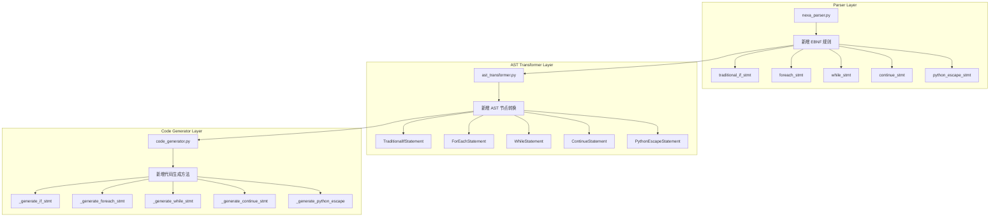

# Nexa v1.0.1-beta 实施计划

## 架构概览



## 文件修改清单

### 1. src/nexa_parser.py
**修改位置**: 第 60-70 行附近，扩展 `flow_stmt` 定义

**新增 EBNF 规则**:
```python
# 在 flow_stmt 中添加新语句类型
?flow_stmt: assignment_stmt 
          | expr_stmt 
          | semantic_if_stmt
          | traditional_if_stmt    # 新增
          | foreach_stmt           # 新增
          | while_stmt             # 新增
          | loop_stmt 
          | match_stmt 
          | assert_stmt 
          | try_catch_stmt 
          | print_stmt 
          | break_stmt 
          | continue_stmt          # 新增
          | python_escape_stmt     # 新增

# 传统 if/else if/else
traditional_if_stmt: "if" "(" traditional_condition ")" block else_if_clause* else_clause?
else_if_clause: "else" "if" "(" traditional_condition ")" block
else_clause: "else" block
traditional_condition: logical_expr
logical_expr: comparison_expr (("and" | "or") comparison_expr)*

# for each 循环
foreach_stmt: "for" "each" IDENTIFIER "in" expression block
            | "for" "each" IDENTIFIER "," IDENTIFIER "in" expression block

# while 循环  
while_stmt: "while" "(" traditional_condition ")" block

# continue 语句
continue_stmt: "continue" ";"

# Python 逃生舱
python_escape_stmt: PYTHON_ESCAPE_OPEN PYTHON_BLOCK PYTHON_ESCAPE_CLOSE
PYTHON_ESCAPE_OPEN: "<|python|>"
PYTHON_ESCAPE_CLOSE: "<|end|>"
PYTHON_BLOCK: /(?s)(?!<\|end\|>).*/
```

### 2. src/ast_transformer.py
**新增方法**: 约 50 行代码

### 3. src/code_generator.py  
**新增方法**: 约 80 行代码

## 语法对比示例

### if/else if/else
```nexa
// 确定性条件判断 - 新增
if (score >= 90) {
    grade = "A"
} else if (score >= 80) {
    grade = "B"  
} else {
    grade = "F"
}

// vs 语义条件判断 - 现有
semantic_if "内容是否积极" against text {
    // ...
}
```

### 循环对比
```nexa
// while - 新增 (确定性)
while (count > 0) {
    print(count)
    count = count - 1
}

// loop...until - 现有 (语义)
loop {
    result = Agent.run(input)
} until ("结果满意")
```

### Python 逃生舱
```nexa
flow example() {
    // 直接嵌入 Python
    <|python|>
import pandas as pd
df = pd.read_csv("data.csv")
processed = df["column"].tolist()
    <|end|>
    
    // 在 Nexa 中使用 Python 变量
    for each item in processed {
        print(item)
    }
}
```

## 实施步骤

### Step 1: Parser 层修改
1. 备份现有 nexa_parser.py
2. 添加新的词法规则 (PYTHON_ESCAPE_OPEN/CLOSE/BLOCK)
3. 扩展 flow_stmt 定义
4. 添加新的语法规则
5. 运行解析测试

### Step 2: AST Transformer 层修改
1. 添加 traditional_if_stmt 转换方法
2. 添加 foreach_stmt 转换方法
3. 添加 while_stmt 转换方法
4. 添加 continue_stmt 转换方法
5. 添加 python_escape_stmt 转换方法

### Step 3: CodeGen 层修改
1. 扩展 _generate_statement 方法
2. 添加各语句类型的代码生成逻辑
3. 处理缩进级别管理

### Step 4: 集成测试
1. 创建测试文件 examples/15_native_controls_and_python.nx
2. 运行编译测试
3. 运行生成的 Python 脚本

### Step 5: 文档更新
1. 更新语法参考文档
2. 更新版本记录

## 预期产出

1. **可编译**: 新语法可被 Nexa 解析器正确解析
2. **可执行**: 生成的 Python 脚本可直接运行
3. **可维护**: 代码结构清晰，与现有架构兼容
4. **可扩展**: 为未来版本预留扩展点